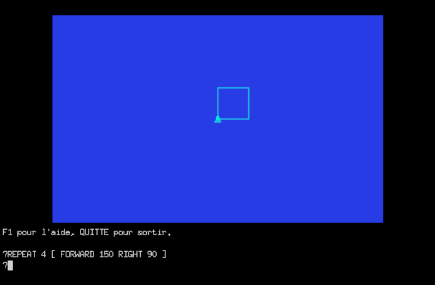

<div align="center">


# GoLogo

**A bilingual (French / English) Logo, with a retro look and a modern engine.**
**Un Logo bilingue (français / anglais), au look rétro et au moteur moderne.**



[English](#english) · [Français](#français) · [Documentation](https://gologo.be-root.com/) · License: [GPL v2](LICENSE)

</div>

---

## English

GoLogo is a Logo interpreter written in pure Go. It is a modern, cross-platform
re-creation of the French Logo that shipped on the 1984 Thomson MO5 cartridge
(SOLI), keeping its spirit and its look while running on today's
machines.

You write instructions, a turtle obeys, and shapes appear on screen.

### Features

- **Bilingual language**: every command exists in French and English (`AVANCE` / `FORWARD`, `REPETE` / `REPEAT`).
- **Turtle graphics** with a modern renderer (Gio), drawn on a fixed logical field.
- **About 200 commands**: turtle and pen, lists and words, control flow, recursion, arithmetic and trigonometry, sprites, fill, music, mouse and joystick, PNG export.
- **Built-in help**: press `F1` for the beginner help (the original SOLI commands, under their full names), `Shift+F1` for the full help. Help and documentation are bilingual.
- **Full-screen editor** with FR↔EN program translation (`Ctrl+T`).
- **Ready-to-run examples**: figures, image generation (ray tracing, Mandelbrot, wireframe landscape) and real little games.
- **Single static binary**, fullscreen "kiosk" mode suited to the classroom.

### Install

Ready-to-use binaries for **Windows, Linux and macOS** are published on the
[Releases page](https://github.com/clamy54/gologo/releases):

- **Windows** — download and run the installer `GoLogo-Setup-x.x.exe`.
- **Linux (Debian / Ubuntu)** — download the `.deb` package and install it with apt:
  `sudo apt install ./gologo_x.x_amd64.deb`.
- **macOS (Apple Silicon only — M1 and later)** — unzip the archive and drag
  `GoLogo.app` into Applications. Intel-based Macs are **not** supported.

On **Windows and macOS the binaries are not signed** (code signing certificates are
expensive and not justified for a free application), so your system may show a
security warning the first time you run GoLogo (Windows SmartScreen / macOS
Gatekeeper). This is normal — the
[installation guide](https://gologo.be-root.com/en/installation.html) gives the
click-by-click steps for each platform.

### Build from source

GoLogo uses [Gio](https://gioui.org), which needs **CGO** and the native GUI
libraries of each platform, so it is built on each OS.

Requirements: **Go 1.25+**, a C toolchain, and the Gio system dependencies
(see the [Gio install guide](https://gioui.org/doc/install)).

Requirements on ubuntu 26.04 :

```sh
sudo apt install -y golang gcc pkg-config libasound2-dev libxkbcommon-dev libxkbcommon-x11-dev libwayland-dev wayland-protocols libx11-dev libxcursor-dev libxfixes-dev libegl1-mesa-dev libgles2-mesa-dev libvulkan-dev libffi-dev libx11-xcb-dev libxcb1-dev   libx11-dev libxcursor-dev libxfixes-dev   libwayland-dev libegl1-mesa-dev
```


```sh
cd src
go build ./cmd/gologo
./gologo          # fullscreen (Ctrl+Q or BYE to quit)
./gologo -w       # windowed (development)
```

Helper build scripts (with the application icon) live in
[`tools/build/`](tools/build); platform installers and packages live in
[`dist/`](dist).

### Documentation

Browse the full bilingual documentation online at
**[gologo.be-root.com](https://gologo.be-root.com/)**. It covers installation,
getting started, the language, the interface and the complete command reference.
The same pages are also bundled in [`doc/`](doc) (open `doc/en/index.html` or
`doc/fr/index.html`).

### License

GoLogo is free software, released under the **GNU General Public License v2**
(see [LICENSE](LICENSE)). © 2024-2026 Cyril Lamy.

---

## Français

GoLogo est un interpréteur Logo écrit en Go pur. C'est une recréation moderne et
multiplateforme du Logo français de la cartouche Thomson MO5 de 1984 (SOLI) : on
en garde l'esprit et le look, mais il tourne sur les machines d'aujourd'hui.

Vous écrivez des instructions, la tortue obéit, et des figures apparaissent à
l'écran.

### Fonctionnalités

- **Langage bilingue** : chaque commande existe en français et en anglais (`AVANCE` / `FORWARD`, `REPETE` / `REPEAT`).
- **Graphisme tortue** avec un rendu moderne (Gio), sur un champ logique fixe.
- **Environ 200 commandes** : tortue et crayon, listes et mots, structures de contrôle, récursivité, arithmétique et trigonométrie, lutins, remplissage, musique, souris et manette, export PNG.
- **Aide intégrée** : `F1` ouvre l'aide débutant (les commandes d'origine SOLI, sous leur nom complet), `Maj+F1` l'aide complète. Aide et documentation sont bilingues.
- **Éditeur plein écran** avec traduction du programme FR↔EN (`Ctrl+T`).
- **Exemples prêts à l'emploi** : figures, génération d'images (lancer de rayon, Mandelbrot, paysage fil de fer) et de vrais petits jeux.
- **Binaire unique**, mode « kiosque » plein écran adapté à l'usage scolaire.

### Installation

Des binaires prêts à l'emploi pour **Windows, Linux et macOS** sont publiés sur la
[page Releases](https://github.com/clamy54/gologo/releases) :

- **Windows** — téléchargez et lancez l'installeur `GoLogo-Setup-x.x.exe`.
- **Linux (Debian / Ubuntu)** — téléchargez le paquet `.deb` et installez-le avec apt :
  `sudo apt install ./gologo_x.x_amd64.deb`.
- **macOS (Apple Silicon uniquement — M1 et ultérieurs)** — décompressez l'archive et
  glissez `GoLogo.app` dans Applications. Les Mac à processeur Intel ne sont **pas**
  pris en charge.

Sous **Windows et macOS, les binaires ne sont pas signés** (les certificats de
signature de code sont coûteux et ne se justifient pas pour une application gratuite) :
votre système peut donc afficher un avertissement de sécurité au premier lancement
(Windows SmartScreen / macOS Gatekeeper). C'est normal — le
[guide d'installation](https://gologo.be-root.com/fr/installation.html) détaille la
marche à suivre, étape par étape, pour chaque plateforme.

### Compiler depuis les sources

GoLogo utilise [Gio](https://gioui.org), qui nécessite **CGO** et les
bibliothèques graphiques natives de chaque plateforme : on le compile donc sur
chaque OS.

Prérequis : **Go 1.25+**, une chaîne C, et les dépendances système de Gio
(voir le [guide d'installation Gio](https://gioui.org/doc/install)).

Dépendances nécessaires sur ubuntu 26.04 :

```sh
sudo apt install -y golang gcc pkg-config libasound2-dev libxkbcommon-dev libxkbcommon-x11-dev libwayland-dev wayland-protocols libx11-dev libxcursor-dev libxfixes-dev libegl1-mesa-dev libgles2-mesa-dev libvulkan-dev libffi-dev libx11-xcb-dev libxcb1-dev   libx11-dev libxcursor-dev libxfixes-dev   libwayland-dev libegl1-mesa-dev
```


```sh
cd src
go build ./cmd/gologo
./gologo          # plein écran (Ctrl+Q ou QUITTE pour sortir)
./gologo -w       # fenêtré (développement)
```

Des scripts de compilation (avec l'icône de l'application) sont dans
[`tools/build/`](tools/build) ; les installeurs et paquets par plateforme sont
dans [`dist/`](dist).

### Documentation

La documentation bilingue complète est en ligne sur
**[gologo.be-root.com](https://gologo.be-root.com/)**. Elle couvre l'installation,
la prise en main, le langage, l'interface et la référence complète des commandes.
Les mêmes pages sont aussi incluses dans [`doc/`](doc) (ouvrez `doc/fr/index.html`
ou `doc/en/index.html`).

### Licence

GoLogo est un logiciel libre, distribué sous **licence publique générale GNU
v2** (voir [LICENSE](LICENSE)). © 2024-2026 Cyril Lamy.
